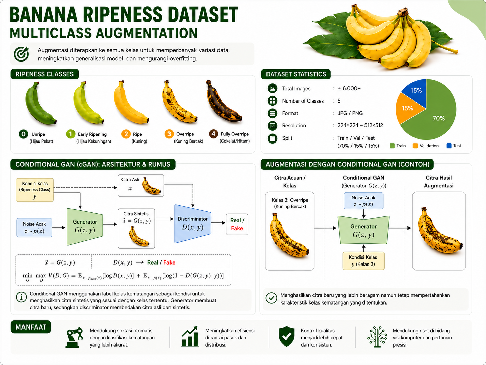

# Framework Conditional GAN + CNN Classifier

Project ini sekarang memakai workflow dua tahap:

1. `Conditional GAN` dilatih untuk mempelajari distribusi gambar tiap kelas.
2. Generator membuat gambar sintetis per kelas ke folder `outputs/generate_synthetic_image/<class_name>`.
3. Gambar sintetis digabung ke train set untuk melatih classifier CNN custom atau pretrained.
4. Evaluasi akhir menampilkan confusion matrix, kurva loss/accuracy classifier, distribusi embedding discriminator, realism score, dan jarak fitur real-vs-sintetis.





## Struktur dataset

```text
dataset/
├── banana_ripeness/
│   ├── unripe/
│   ├── ripe/
│   └── overripe/
├── cxr/
│   ├── normal/
│   └── pneumonia/
└── retinal_oct/
    ├── class_1/
    └── class_2/
```

Aturan:

```text
1 sub-folder = 1 kelas
nama sub-folder = nama kelas
```

## Menjalankan training lengkap

```bash
python train.py
```

Tahap yang dijalankan:

1. Split dataset train/val/test
2. Train conditional GAN
3. Generate gambar sintetis per kelas
4. Analisis embedding discriminator dan feature distance
5. Train classifier dengan train set asli + sintetis
6. Evaluasi test set classifier

## Menjalankan evaluasi ulang

```bash
python evaluate.py
```

## Output utama

```text
outputs/
├── best_gan.pth
├── best_model.pth
├── gan_training_history.json
├── gan_training_curve.png
├── training_history.json
├── training_curve.png
├── confusion_matrix_test.png
├── test_report.txt
├── embedding_distribution.png
├── embedding_metrics.json
├── feature_error_distribution.png
├── feature_error_metrics.json
├── gan_sample_gallery.png
└── generate_synthetic_image/
    ├── class_name_1/
    └── class_name_2/
```

## Konfigurasi penting di `.env`

- `MODEL_NAME`: classifier downstream (`simple_cnn`, `resnet18`, `mobilenet_v3_small`, `efficientnet_b0`)
- `GAN_LATENT_DIM`: ukuran noise vector untuk generator
- `GAN_LEARNING_RATE_G` dan `GAN_LEARNING_RATE_D`: learning rate generator dan discriminator. Default sekarang dibuat sedikit lebih pelan di discriminator agar generator tidak langsung kalah.
- `GENERATED_IMAGES_PER_CLASS`: jumlah gambar sintetis yang dibuat untuk tiap kelas
- `GAN_NOISE_SCALE`: skala noise saat sampling gambar sintetis
- `GAN_FEATURE_MATCH_WEIGHT`: default `0.0`. Jika ingin diaktifkan lagi, gunakan nilai kecil karena objective ini sekarang dihitung per kelas.
- `GAN_EDGE_MATCH_WEIGHT`: mencocokkan peta Sobel dan Laplacian multiskala agar posisi kontur tidak hilang.
- `GAN_EXCLUDE_AUGMENTED`: jika `true`, file dataset berawalan `aug_` tidak dipakai untuk training GAN. Classifier tetap boleh memakai data tersebut.
- `GAN_USE_EDGE_DISCRIMINATOR`: mengaktifkan critic kedua yang hanya melihat peta Sobel/high-frequency.
- `GAN_EDGE_DISCRIMINATOR_WEIGHT`: kontribusi critic tepi terhadap skor adversarial.
- `GAN_USE_SPECTRAL_NORM`: sebaiknya `false` saat memakai WGAN-GP agar critic tidak diregularisasi dua kali.
- `GAN_EMA_DECAY`: smoothing bobot generator. Checkpoint dan preview memakai bobot EMA yang lebih stabil.
- `GAN_AUX_CLASS_WEIGHT`: default `0.5` agar sinyal kelas tetap ada, tetapi tidak mendominasi realism objective.
- `GAN_EARLY_STOPPING`: sebaiknya `false` karena val loss GAN sering tidak sejalan dengan kualitas visual
- `GAN_PER_CLASS`: default `true`, sehingga tiap kelas dilatih dengan GAN sendiri untuk mengurangi mode collapse antar kelas
- `GAN_MODELS_DIRNAME`: folder root untuk menyimpan checkpoint GAN per kelas
- `GAN_LOSS_MODE`: default `wgan_gp` untuk training critic yang lebih stabil pada GAN per kelas
- `GAN_GP_WEIGHT`: bobot gradient penalty untuk `wgan_gp`
- `GAN_DRIFT_WEIGHT`: regularisasi tambahan untuk menahan skor critic agar tidak drift terlalu jauh
- `GAN_DISC_STEPS`: pada `wgan_gp` sebaiknya lebih besar dari `1` karena critic perlu di-update lebih sering
- `IMAGE_SIZE`: default `128` dan harus habis dibagi `16`
- `MAX_PER_CLASS`: set `None` jika ingin GAN belajar dari seluruh dataset yang tersedia
- `CROP_FOREGROUND`, `CROP_THRESHOLD`, `CROP_MARGIN_RATIO`: mengaktifkan crop objek otomatis sebelum resize agar model lebih fokus ke pisang daripada background

## Catatan

- Perubahan arsitektur contour-aware tidak kompatibel dengan checkpoint GAN lama. Gunakan `OUTPUT_DIR` baru dan latih GAN dari awal.
- Gambar sintetis sekarang dihasilkan langsung dari noise terkontrol per kelas, bukan dari rekonstruksi autoencoder.
- Analisis embedding memakai feature space dari discriminator agar kita tetap bisa membandingkan distribusi real dan sintetis.
- Preprocessing gambar sekarang mempertahankan rasio aspek dengan padding ke kanvas persegi sebelum resize, jadi bentuk pisang tidak ikut terdistorsi.
- Sebelum padding dan resize, pipeline sekarang mencoba memotong foreground objek secara otomatis berdasarkan perbedaan warna dengan area sudut gambar.
- Pada mode `GAN per kelas`, analisis embedding PCA dan feature-distance lintas kelas sengaja dilewati karena feature space tiap discriminator tidak comparable.
- Generator memakai residual PixelShuffle dan GroupNorm, bukan bilinear upsampling, agar detail tipis tidak otomatis dihaluskan.
- Checkpoint GAN dipilih dari kombinasi kesalahan kontur, kontras, dan diversitas validation set; critic gap hanya menjadi penalti jika arahnya tidak valid.
